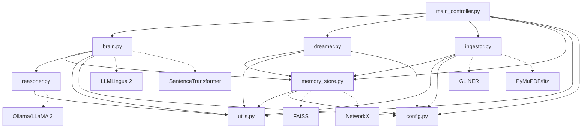

# NS-DMN: Neuro-Symbolic Dynamic Memory Network

## Complete System Summary

---

## 1. Architecture Overview

NS-DMN is a **Retrieval-Augmented Generation (RAG)** system that combines a **knowledge graph**, **vector store (FAISS)**, and a **local LLM (Ollama/LLaMA 3)** into a cognitive pipeline inspired by biological memory systems.

### High-Level Architecture

```
┌──────────────────────────────────────────────────────────────┐
│                     USER INTERFACE                           │
│              main_controller.py (CLI REPL)                   │
│         Commands: /ingest <file> | free-text query           │
└──────────────┬───────────────────────────┬───────────────────┘
               │                           │
       ┌───────▼───────┐          ┌────────▼────────┐
       │   INGESTOR    │          │   NEURAL BRAIN  │
       │  (Wind-Bell)  │          │  (CPU Cortex)   │
       │  ingestor.py  │          │    brain.py      │
       └───────┬───────┘          └────────┬────────┘
               │                           │
               │     ┌─────────────┐       │
               └────►│ SHARED      │◄──────┘
                     │ MEMORY      │
                     │ memory_     │
                     │ store.py    │
                     │             │
                     │ ┌─────────┐ │
                     │ │ NetworkX│ │  ◄── Knowledge Graph
                     │ │  Graph  │ │
                     │ └─────────┘ │
                     │ ┌─────────┐ │
                     │ │  FAISS  │ │  ◄── Vector Store
                     │ │  Index  │ │
                     │ └─────────┘ │
                     └──────┬──────┘
                            │
                     ┌──────▼──────┐
                     │   DREAMER   │
                     │  (Background│
                     │   Thread)   │
                     │ dreamer.py  │
                     └─────────────┘

External Services:
  ┌────────────┐     ┌──────────────┐
  │  Ollama    │     │ HuggingFace  │
  │ (LLaMA 3) │     │   Models     │
  │  GPU LLM  │     │  (GLiNER,    │
  └────────────┘     │ SentenceTF,  │
                     │ LLMLingua)   │
                     └──────────────┘
```

### Data Flow

```
INGESTION PIPELINE:
  PDF → Extract Text → Chunk (1000 chars) → Embed (MiniLM) → Surprise Check
       → Store in FAISS + Graph → Extract Entities (GLiNER) → Link in Graph
       → Auto-save Snapshot

QUERY PIPELINE:
  User Query → Safety Check → Cognitive Router (LLaMA 3 / pattern fallback)
       → Refined Query + Route + Filters
       → Vector Search (FAISS) → Metadata Filtering → Graph Traversal (BFS)
       → Context Compression (LLMLingua / sentence-aware truncation)
       → LLM Generation (LLaMA 3 streaming) → Response
```

---

## 2. File-by-File Breakdown

### Root-Level Files

| File | Purpose |
|---|---|
| `main_controller.py` | **Entry point**. CLI REPL loop. Initializes all components, handles `/ingest` commands, orchestrates query→retrieval→LLM pipeline, manages graceful shutdown via signal handler. |
| `config.py` | **Central configuration**. All constants: paths, FAISS settings, embedding model name/dim, compression tokens, Titans thresholds, operational timeouts. Single source of truth. |
| `benchmark_suite.py` | **Validation/testing script**. Runs 3 tests: ingestion stress, accuracy (F1/EM against golden Q&A), and metabolism (REM consolidation). Generates a Performance Certificate. |
| `migrate_vectors.py` | **Migration utility**. Fixes UUID↔vector desynchronization by reconstructing vectors from FAISS index. Run manually if memory state gets corrupted. |
| `requirements.txt` | **Dependencies** (85 packages). Key: torch, transformers, faiss-cpu, networkx, sentence-transformers, llmlingua, gliner, ollama, pymupdf, rapidfuzz. |

### `modules/` Directory

| File | Class | Purpose |
|---|---|---|
| `__init__.py` | — | Empty. Makes `modules` a Python package. |
| `memory_store.py` | `SharedMemoryManager` | **Thread-safe memory layer**. Manages FAISS index (vector store) + NetworkX graph (knowledge graph) + ID maps (UUID↔FAISS int). Provides atomic add/remove/query/save operations with `threading.RLock`. Implements atomic directory swaps for crash-safe persistence. |
| `brain.py` | `NeuralBrain` | **Query processing engine**. Embeds queries (SentenceTransformer), retrieves context (vector search + graph traversal), compresses context (LLMLingua), and feeds to LLM. Contains the cognitive loop. |
| `ingestor.py` | `WindBellIngestor` | **Document ingestion pipeline**. Extracts text (PyMuPDF/pypdf), chunks into 1000-char segments, embeds with SentenceTransformer, runs Titans surprise check, extracts entities (GLiNER), and links them in the knowledge graph. |
| `dreamer.py` | `MemoryDreamer` | **Background consolidation thread** (daemon). Runs entropy decay (pruning stale nodes), discovers latent associations via FAISS similarity, abstracts dense clusters into "concept" super-nodes with energy-weighted centroids. Implements Titans momentum-based prioritization. |
| `reasoner.py` | `CognitiveRouter` | **Query analysis via LLM**. Uses LLaMA 3 (via Ollama) to: reformulate queries, decide routing strategy (vector/graph/hybrid), extract metadata filters (date, filename). Falls back to pattern-based regex if Ollama is unavailable. |
| `utils.py` | — | **Shared utilities**. Logger setup (file + console), Windows-safe `shutil.rmtree` with retry logic, atomic directory swap for crash-safe persistence, and startup crash recovery. |

### `test/` Directory

| File | Purpose |
|---|---|
| `testing.pdf` | Large test PDF used by `benchmark_suite.py` for ingestion stress testing. |
| `Nlp_project.pdf` | Core system documentation PDF. Contains the NS-DMN architecture description that the system is designed to reason about. |

---

## 3. Key Concepts & Technologies

### 3.1 Neuro-Symbolic Integration

The system merges two AI paradigms:
- **Neural**: Dense vector embeddings (FAISS) for semantic similarity search
- **Symbolic**: Knowledge graph (NetworkX) for structured entity relationships

Queries use both: vector search finds relevant chunks, then graph traversal expands context through entity connections.

### 3.2 Split-Compute Architecture

Hardware-aware resource allocation:
- **CPU**: FAISS search, graph operations, LLMLingua compression, SentenceTransformer encoding
- **GPU**: LLM inference (Ollama/LLaMA 3) — offloaded to separate process

This prevents OOM crashes on consumer hardware (8–16 GB systems).

### 3.3 Titans-Inspired Memory (Surprise Detection)

From Google's Titans paper:
- **Surprise threshold** (`SURPRISE_THRESHOLD = 0.92`): New chunks are compared against existing memory. If similarity ≥ 0.92, the chunk is flagged "redundant" and entity extraction is skipped → prevents graph bloat.
- **Momentum tracking**: Nodes that participate in many latent associations accumulate momentum. High-momentum clusters are consolidated first during REM cycles.
- **Early consolidation**: Clusters with momentum ≥ `REM_MOMENTUM_THRESHOLD` are prioritized for concept abstraction.

### 3.4 Memory Lifecycle (Biological Metaphor)

```
┌────────────┐     ┌──────────────┐     ┌────────────────┐
│  INGESTION │ ──► │  SHORT-TERM  │ ──► │  LONG-TERM     │
│  (Wind-Bell│     │  MEMORY (STM)│     │  MEMORY (LTM)  │
│  Ingestor) │     │  (Queue)     │     │  (Graph+FAISS) │
└────────────┘     └──────────────┘     └────────┬───────┘
                                                 │
                                        ┌────────▼───────┐
                                        │  REM CYCLE     │
                                        │  (Dreamer)     │
                                        │  - Decay       │
                                        │  - Prune       │
                                        │  - Associate   │
                                        │  - Abstract    │
                                        └────────────────┘
```

- **Ingestion** → STM queue → Dreamer consolidates to LTM
- **Entropy Decay**: Node energy decreases over time (`ENTROPY_DECAY_RATE = 0.1` per hour)
- **Pruning**: Nodes with energy ≤ 0 are removed
- **REM Cycle** (every 5 min idle): Discovers latent links, creates concept super-nodes

### 3.5 IM-RAG (Inner Monologue RAG)

The `CognitiveRouter` acts as a "thinking" layer before retrieval:

1. **Reformulates** the user query into a better search string
2. **Decides routing**: `vector` (pure similarity), `graph` (relationship-heavy), `hybrid` (both)
3. **Extracts metadata filters**: date ranges, filenames
4. **Identity guard**: Prevents the LLM from confusing NS-DMN's architecture with other papers

### 3.6 Context Compression (LLMLingua 2)

Uses Microsoft's LLMLingua-2 (BERT-based) to compress retrieved context before sending to LLM:
- **Rate**: 0.75 (retains ~75% of content)
- **Token budget**: 1800 tokens max
- **Safeguard**: Skips compression if context is already small (< 1800 tokens)
- **Fallback**: Sentence-aware truncation (no mid-sentence cuts) if LLMLingua fails or is unavailable

### 3.7 Entity Extraction (GLiNER)

SLM-based Named Entity Recognition using GLiNER (`urchade/gliner_multi`):
- **Labels**: person, organization, location, technology, concept, metric, method
- Extracts entities as triplets: `(entity_text, "is_type", entity_label)`
- Entities become graph nodes linked to their source chunks via `"mentions"` edges

### 3.8 Graph Traversal (Multi-Hop BFS)

Prioritized context retrieval:
1. **Primary bucket**: Entity expansion — follows `mentions` edges to find source chunks
2. **Secondary bucket**: Standard BFS traversal up to 2 hops
3. **Deduplication**: Chunks in primary are excluded from secondary
4. **Hard cap**: 15 context documents maximum

### 3.9 Atomic Persistence

Crash-safe data saving:
1. Serialize graph, FAISS index, ID maps, vectors to a temp directory
2. Atomic directory swap: `data → data.bak`, `data_tmp → data`
3. Delete backup
4. Startup recovery: If `data.bak` exists but `data` doesn't → restore from backup

### 3.10 Thread Safety

- All memory operations use `threading.RLock` (reentrant lock)
- Dreamer runs as a daemon thread with STM queue for inter-thread communication
- `POISON_PILL` sentinel for graceful shutdown

---

## 4. How to Run

### Prerequisites

- **Python 3.11+**
- **Ollama** installed and running with `llama3` model pulled
- **~8 GB RAM** (LLaMA 3 8B + FAISS + embeddings)
- **Windows** (tested; Linux should work with path adjustments)

### Setup

```bash
# 1. Create virtual environment
python -m venv venv

# 2. Activate it
# Windows:
.\venv\Scripts\activate
# Linux/Mac:
source venv/bin/activate

# 3. Install dependencies
pip install -r requirements.txt

# 4. Ensure Ollama is running with LLaMA 3
ollama pull llama3
ollama serve   # (if not already running)
```

### Running the System

```bash
# Start the interactive CLI
python main_controller.py
```

**First-time startup will download models** (~400 MB for SentenceTransformer, ~1 GB for GLiNER). This is a one-time download.

### Using the CLI

```
# Ingest a document
>>> User: /ingest test/Nlp_project.pdf

# Ask questions about ingested content
>>> User: What is the Wind-Bell Indexing Strategy?

# Ask relationship questions
>>> User: How does the Cerebellum relate to the Dreamer?

# Exit
>>> User: exit
```

### Running Benchmarks

```bash
# Ensure test/testing.pdf exists, then:
python benchmark_suite.py
```

### Migration Utility

```bash
# If vector/UUID desync is detected:
python migrate_vectors.py
```

---

## 5. Known Issues & Bugs

### 🔴 Critical: FAISS Index Type Mismatch

**File**: `memory_store.py`, line 42

```python
self.index = faiss.IndexIDMap(faiss.IndexFlatL2(self.embedding_dim))
```

**Problem**: The code uses `IndexFlatL2` (L2/Euclidean distance), but the debugging plan (Step 1) states it was changed to `IndexFlatIP` (Inner Product / cosine similarity). The fix was either not applied to this copy or was reverted.

**Impact**: 
- `query_similarity()` returns L2 distances, not cosine similarities
- The surprise detection in `ingestor.py` compares these distances against `SURPRISE_THRESHOLD = 0.92`, which assumes cosine similarity (0–1 range). L2 distances are unbounded, making the threshold meaningless.
- The dreamer's `similarity = 1.0 - (dist / 2.0)` conversion (line 223) is a workaround for L2, but only correct if vectors are L2-normalized before insertion.

**Fix needed**: Either:
1. Change to `IndexFlatIP` and normalize vectors before insertion, OR
2. Keep `IndexFlatL2` but adjust all thresholds and remove the dreamer's conversion formula

---

### 🔴 Critical: No Vector Normalization

**Files**: `memory_store.py` (`add_memory`), `ingestor.py` (`ingest_document`)

**Problem**: Vectors from `SentenceTransformer.encode()` are stored directly without L2 normalization. If using `IndexFlatIP` for cosine similarity, vectors **must** be normalized.

**Impact**: Cosine similarity calculations will be incorrect. Inner product on unnormalized vectors ≠ cosine similarity.

**Fix needed**: Add normalization in `add_memory()`:
```python
vector = vector / np.linalg.norm(vector)
```

---

### 🟡 Medium: Chunking Not Sentence-Aware

**File**: `ingestor.py`, lines 298–299

```python
CHUNK_SIZE = 1000
chunks = [text[i:i+CHUNK_SIZE] for i in range(0, len(text), CHUNK_SIZE)]
```

**Problem**: Fixed 1000-character slicing with no overlap. Cuts sentences and words mid-text. Step 6 of the debugging plan says semantic chunking was implemented, but this code still uses naive slicing.

**Impact**: Chunks may contain incomplete sentences at boundaries, hurting both entity extraction quality and retrieval relevance.

**Fix needed**: Implement sentence-aware chunking with overlap (e.g., using NLTK `sent_tokenize`).

---

### 🟡 Medium: Dreamer L2-to-Similarity Conversion

**File**: `dreamer.py`, line 223

```python
similarity = 1.0 - (dist / 2.0)
```

**Problem**: This formula converts L2² distance to approximate cosine similarity, but only works correctly when:
1. The FAISS index uses `IndexFlatL2`
2. All vectors are L2-normalized before insertion

Neither condition is explicitly enforced.

**Impact**: Latent association discovery may create incorrect links (too many or too few).

---

### 🟢 Minor: Hardcoded LLM Model

**File**: `main_controller.py`, line 65

```python
LLM_MODEL = "llama3"
```

**Problem**: Model name is hardcoded, not configurable via `config.py`.

**Impact**: Must edit source code to change the LLM model.

---

### 🟢 Minor: No NLTK Data Download

**Problem**: `nltk` is in `requirements.txt` but no `nltk.download('punkt')` call exists. If NLTK tokenizers are needed for future sentence-aware chunking, this will fail silently.

---

## 6. Expected Outcomes

### On Startup (`python main_controller.py`)

```
=== Neuro-Symbolic Dynamic Memory Network (NS-DMN) ===
[Init] Checking file system state...
[Init] Loading Shared Memory (Graph + Vector Store)...
[Init] Waking up the Dreamer...
[Init] Initializing Neural Brain (CPU Cortex)...
  - Loads SentenceTransformer (all-MiniLM-L6-v2 ~80MB)
  - Loads LLMLingua (BERT model ~300MB)
[Init] Initializing Ingestion Engine (Wind-Bell)...
  - Loads GLiNER (gliner_multi ~500MB)
[Init] Connecting to Ollama (GPU Cortex)...

System Online. Type 'exit' or 'quit' to stop.
Commands: /ingest <path_to_pdf>
```

### On Document Ingestion (`/ingest test/Nlp_project.pdf`)

Expected behavior:
1. PDF text extraction (PyMuPDF) — instant
2. Chunking into N segments (~1000 chars each)
3. For each chunk: embed → surprise check → entity extraction → store → link
4. Auto-save snapshot to disk
5. Typical duration: 30–120 seconds depending on PDF size

Console output:
```
[System] Ingesting: test/Nlp_project.pdf
INFO: Starting ingestion for: test/Nlp_project.pdf
INFO: Split into N chunks. Processing...
INFO: [Titans] High surprise: 0.XXX < 0.92 (novel)     ← Novel chunks
INFO: [Titans] Low surprise: 0.XXX >= 0.92 (redundant)  ← Redundant chunks (skipped)
INFO: Ingestion complete for test/Nlp_project.pdf. Found M entities in X.XXs
INFO: [Ingestor] Auto-save complete. Data is now persistent.
```

### On Query

Expected behavior:
1. Cognitive Router analyzes query (0.5–3s via Ollama, or instant fallback)
2. Vector search retrieves top-5 chunks
3. Graph traversal expands context (2-hop BFS)
4. Context compression (LLMLingua or sentence-aware truncation)
5. LLM generates response via Ollama streaming

Console output:
```
[Brain] Inner Monologue: The user is asking about...
[Brain] Routing: HYBRID | Refined Query: ...
[Step9 Debug] Raw context length: XXXX chars (N docs)
[Step9 Debug] Compressed context length: XXXX chars (ratio: 0.XX)
[System] Thinking... (Context Size: XXXX chars)
>>> Assistant: <streamed response>
```

### On Benchmark (`python benchmark_suite.py`)

Three tests run sequentially:

| Test | Metric | Expected Range | Pass Condition |
|---|---|---|---|
| Ingestion Stress | Tokens/sec (TPI) | 200–2000+ | > 100 tokens/sec |
| Accuracy (F1) | Token-level F1 | 0.15–0.80 | > 0.50 |
| Accuracy (EM) | Exact Match | 0.0–0.30 | Informational |
| Consolidation | New Concepts | 0–5 per cycle | Status: ACTIVE |

**Note**: F1 scores depend heavily on whether the FAISS/normalization bugs are fixed. With current L2 index and no normalization, retrieval quality is degraded.

### On Graceful Shutdown (Ctrl+C)

```
[System] Shutdown Signal Received using Ctrl+C. Initiating Graceful Exit...
[System] Waiting for Dreamer to save memory...
INFO: Poison Pill received. Saving state and exiting.
INFO: Acquired Lock. Starting Memory Snapshot...
INFO: Snapshot Saved Successfully.
[System] Shutdown Complete. Goodbye.
```

### Data Persistence

After ingestion, data is saved to `data/`:
```
data/
├── graph_data.pkl       # NetworkX graph (serialized)
├── vector_store.index   # FAISS index (binary)
├── id_map.json          # UUID ↔ FAISS ID mapping
└── vectors.pkl          # Raw vectors dictionary
```

On next startup, this data is automatically loaded. To reset, delete the `data/` directory.

---

## 7. Configuration Reference

| Constant | File | Default | Purpose |
|---|---|---|---|
| `EMBEDDING_MODEL_NAME` | config.py | `all-MiniLM-L6-v2` | SentenceTransformer model for embeddings |
| `EMBEDDING_DIM` | config.py | `384` | Vector dimension (must match model) |
| `COMPRESSION_TARGET_TOKENS` | config.py | `1800` | Max tokens after LLMLingua compression |
| `SURPRISE_THRESHOLD` | config.py | `0.92` | Similarity above this = redundant (skip) |
| `ENTROPY_DECAY_RATE` | config.py | `0.1` | Energy deduction per hour of inactivity |
| `PRUNING_THRESHOLD` | config.py | `0.0` | Nodes with energy ≤ this are deleted |
| `SIMILARITY_THRESHOLD` | config.py | `75` | RapidFuzz ratio for entity merging |
| `SAVE_INTERVAL_SECONDS` | config.py | `600` | Auto-save frequency (10 minutes) |
| `DREAMER_BATCH_SIZE` | config.py | `5` | STM items processed before maintenance |
| `REM_MIN_CLIQUE_SIZE` | config.py | `3` | Minimum clique size for concept creation |
| `REM_MOMENTUM_THRESHOLD` | config.py | `5` | Momentum threshold for early consolidation |

---

## 8. Dependency Map



---

## 9. Quick Troubleshooting

| Symptom | Likely Cause | Fix |
|---|---|---|
| `Ollama not found` | Ollama not installed or not running | `ollama serve` then `ollama pull llama3` |
| `GLiNER failed to load` | PyTorch version mismatch | Ensure torch ≥ 2.3.1; the patched loader handles legacy weights |
| `Persistence mismatch detected!` | Crash during save | Run `python migrate_vectors.py` |
| Very low F1 scores (~0) | FAISS returns wrong results | Fix IndexFlatL2 → IndexFlatIP + normalize vectors |
| All chunks marked redundant | Surprise threshold miscalibrated | Check if similarity values are actually in 0–1 range |
| `Compression failed` | LLMLingua OOM | System falls back to sentence-aware truncation automatically |
| `Snapshot Swap Failed` | Windows file locks | Retry; the system has built-in retry with backoff |
| Empty retrieval results | No documents ingested | Run `/ingest test/Nlp_project.pdf` first |
